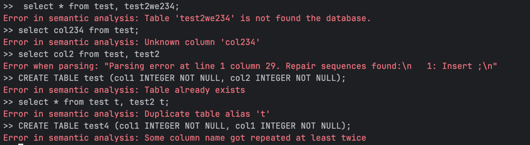

# My-DB 

An in-memory, row-store relational database engine written in Rust with an interactive SQL REPL and JIT-compiled SELECT queries.

Tested on Linux and macOS.

---

## Overview

IMLAB executes SQL queries with zero interpretation overhead by JIT-compiling SELECT statements to native machine code at runtime. Each query is transformed into a Rust source file, compiled to a shared library via `rustc`, dynamically loaded with `dlopen`, and executed as a native function — delivering full CPU optimization for every query.

**Key characteristics:**
- In-memory row-based storage
- Interactive SQL REPL with readline support
- JIT-compiled query execution (codegen → rustc → dlopen)
- Volcano model query execution with relational algebra operators
- Morsel-driven parallelism via Rayon
- Lock-free hash join with CAS-based finalization
- Type-safe schema management with 64-bit packed type encoding

---

## Quick Start

Run the database:

```bash
RUSTFLAGS=-Awarnings cargo run --bin sql --release
```

To print generated JIT code:

```bash
RUSTFLAGS=-Awarnings IMLAB_PRINT_CODE=true cargo run --bin sql --release
```

Example session in the REPL:

```sql
CREATE TABLE test (col1 INTEGER NOT NULL, col2 INTEGER NOT NULL);
CREATE TABLE test2 (col1 VARCHAR(20) NOT NULL, col2 INTEGER NOT NULL);
COPY test FROM 'test_data/test.tbl' DELIMITER '|';
COPY test2 FROM 'test_data/test2.tbl';
SELECT * FROM test;
SELECT col1 FROM test;
SELECT * FROM test WHERE test.col1 = 1;
SELECT * FROM test t WHERE t.col1 = 1;
SELECT * FROM test t, test2 t2 WHERE t.col2 = t2.col2;
SELECT * FROM test t, test2 t2 WHERE t.col2 = t2.col2 AND t.col2 = 123;
SELECT * FROM test t, test2 t2 WHERE t.col2 = t2.col2 AND t.col2 >= 124;
SELECT * FROM test t, test2 t2 WHERE t.col2 = t2.col2 AND t.col2 != 123;
exit
```

### TPCC Dataset

Download the dataset from [here](https://db.in.tum.de/teaching/ws2122/imlab/tpcc_5w.tar.gz) and place files under `data/tpcc/`, then:

```sql
startup_tpcc
SELECT * FROM test, (SELECT h_c_id FROM history) h WHERE h.h_c_id = test.col2;
exit
```

### IMDB Benchmark

Store dataset files in `data/imdb/`, then:

```sql
startup_imdb
```

---

## SQL Grammar

```
CREATE TABLE table_name (
    column_name data_type NOT NULL
    [, column_name data_type NOT NULL]...
    [, PRIMARY KEY (column_name [, column_name]...)]
);

COPY table_name FROM 'file' [DELIMITER 'delimiter'];

SELECT { * | column_name [, column_name]... }
FROM table_name [alias] [, table_name [alias]]...
[ WHERE column_name = { column_name | constant }
  [ AND column_name = { column_name | constant } ]... ];

-- Subqueries
SELECT ... FROM table_name, (SELECT ...) subquery_name ...
```

---

## Architecture

```
┌─────────────────────────────────────────────────────────┐
│                SQL REPL (bin/sql.rs)                    │
└──────────────────┬──────────────────────────────────────┘
                   │
┌──────────────────▼──────────────────────────────────────┐
│              Parser Layer (parser/)                     │
│   Lexer (sql.l) → Grammar (sql.y) → AST                 │
└──────────────────┬──────────────────────────────────────┘
                   │
┌──────────────────▼──────────────────────────────────────┐
│           Semantic Analysis (semana/)                   │
│   Type checking, reference resolution, scope mgmt       │
└──────────────────┬──────────────────────────────────────┘
                   │
┌──────────────────▼──────────────────────────────────────┐
│          Statement Execution (statement/)               │
│          CREATE TABLE · COPY · SELECT                   │
└──────────────────┬──────────────────────────────────────┘
                   │
┌──────────────────▼──────────────────────────────────────┐
│         Relational Algebra Layer (algebra/)             │
│         TableScan · Select · Join · Print               │
└──────────────────┬──────────────────────────────────────┘
                   │
┌──────────────────▼──────────────────────────────────────┐
│           Code Generation (codegen/)                    │
│   Rust codegen → rustc → shared lib → dlopen → execute  │
└──────────────────┬──────────────────────────────────────┘
                   │
┌──────────────────▼──────────────────────────────────────┐
│             Storage Engine (db/)                        │
│   Row-store · Type system · Primary key index           │
└─────────────────────────────────────────────────────────┘
```

---

## Query Execution Pipeline

A SELECT query goes through six stages:

**1. Parsing** — The lexer tokenizes the input and the LR parser builds a typed AST.

**2. Semantic Analysis** — Tables and columns are validated, aliases resolved, Internal Units (IUs — logical column references) created, and predicates classified as join conditions or filters.

**3. Optimization** — Predicate pushdown moves filter operators below joins. Each operator runs a `prepare()` phase before and after optimization.

**4. Code Generation** — The operator tree is traversed top-down via `produce()` calls, with code materialized bottom-up via `consume()`. A `TupleCtx` struct carries variable expressions for each IU through the traversal.

**5. Compilation & Loading**
```
Generated Rust source
    → write to temp .rs file
    → spawn rustc (release mode)
    → compile to .so / .dylib
    → dlopen() into process memory
    → dlsym() to extract function pointer
```

**6. Execution** — The native function is called with a pointer to the database. Metrics (compilation time, execution time, row count) are printed on completion.

---

## Core Components

### Parser (`src/parser/`)

Uses `lrlex` + `lrpar` (Rust equivalents of Lex/Yacc) for compile-time LR parser generation. The lexer is case-insensitive. The grammar is conflict-free and produces strongly-typed AST nodes covering DDL and DQL.

### Semantic Analysis (`src/semana/`)

Validates the AST against the live schema. Builds `Scope` objects for name resolution and produces typed `Statement` objects ready for execution. Errors are surfaced with precise messages.

### Relational Algebra (`src/algebra/`)

Operators follow the Volcano model — each implements `produce()` and `consume()` for the codegen traversal.

- **TableScan** — Iterates rows using morsel-driven parallelism (Rayon par_iter + cache-sized chunks).
- **Select** — Applies equality predicates; pushed down during optimization.
- **Join** — Hash join with parallel build phase. The `LazyMultiMapParBuilder` uses thread-local buffers for zero-contention insertion, then finalizes with a lock-free CAS-based linked-list merge:
  ```rust
  loop {
      let head = table[bucket].load(Ordering::Relaxed);
      entry.next = head;
      if table[bucket].compare_exchange_weak(head, entry_ptr,
          Ordering::Relaxed, Ordering::Relaxed).is_ok() { break; }
  }
  ```
- **Print** — Root operator that formats and outputs results.

### Type System (`src/types/`)

All type metadata fits in a single 64-bit word:

```
Bits 63–56:  Type tag (INTEGER, VARCHAR, NUMERIC, etc.)
Bits 55–24:  Precision / length
Bits 23–8:   Scale (for NUMERIC)
Bits 7–0:    Flags (nullable, etc.)
```

Supported types: `INTEGER`, `BOOLEAN`, `NUMERIC(p,s)`, `TEXT`, `VARCHAR(n)`, `CHAR(n)`, `TIMESTAMP`.

### Storage Engine (`src/db/`)

Row-store layout with contiguous byte arrays. Column access is `row_id * row_size + col_offset`. Primary keys are indexed via an `ahash`-backed `FastMap<KeyBytes → RowId>` for O(1) lookups.

### Code Generation (`src/codegen/`)

Generates a self-contained Rust function per query. The function takes a raw `*const Database` pointer, reconstructs table references, and emits parallelized row iteration with inlined predicates and projections — no interpreter dispatch at query runtime.

---

## Module Structure

```
src/
├── algebra/        # Operator tree (scan, select, join, print)
├── codegen/        # Rust code generation + compilation pipeline
├── db/             # Storage engine (table, column, row, value)
├── infra/          # LazyMultiMap, lock-free hash table utilities
├── parser/         # Lexer (sql.l), grammar (sql.y), AST, expressions
├── semana/         # Semantic analysis, scope management, errors
├── statement/      # CREATE / COPY / SELECT statement execution
├── types/          # Type system (integer, text, numeric, bool, timestamp)
└── util/           # I/O helpers

bin/
├── sql.rs          # Interactive SQL REPL
├── tpcc.rs         # TPC-C benchmark driver
└── create_table.rs # DDL utility
```

---

## Dependencies

| Crate | Purpose |
|---|---|
| `lrlex` + `lrpar` | Compile-time LR lexer/parser generation |
| `libloading` | Dynamic library loading for JIT code |
| `rayon` | Parallel query execution |
| `hashbrown` + `ahash` | Fast hash maps and sets |
| `rustyline` | REPL with readline support |
| `enum_dispatch` | Efficient operator dispatch without vtables |
| `anyhow` + `thiserror` | Error handling |
| `colored` | Terminal output |
| `csv` | Data loading |

---

## Error Examples



---

## Performance

- **JIT compilation** eliminates interpreter overhead — each query runs as native optimized code
- **Morsel-driven parallelism** keeps CPU caches warm and balances work across cores automatically
- **Lock-free hash joins** allow all threads to build the hash table concurrently
- **Predicate pushdown** reduces rows processed at each operator level
- **64-bit type encoding** makes schema arrays cache-friendly

### Known limitations

- In-memory only (no persistence or disk spill)
- Equality predicates only in WHERE clauses (no ranges, LIKE, IN)
- No cost-based query optimizer
- No aggregate functions (SUM, COUNT, GROUP BY)
- No ORDER BY / LIMIT

---

## Testing

Unit and integration tests are colocated with their modules using `#[cfg(test)]`. Coverage includes parser grammar, type encoding/decoding, table operations, and end-to-end query execution.
